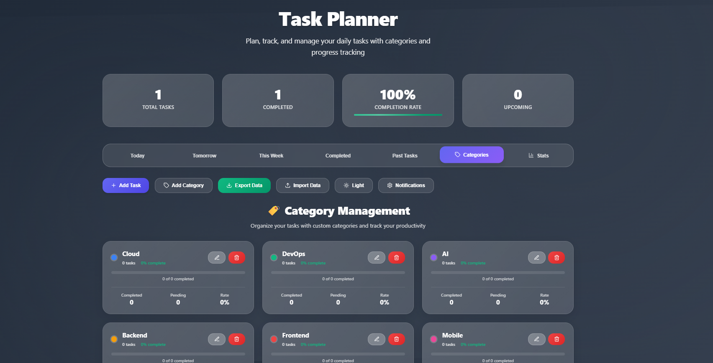
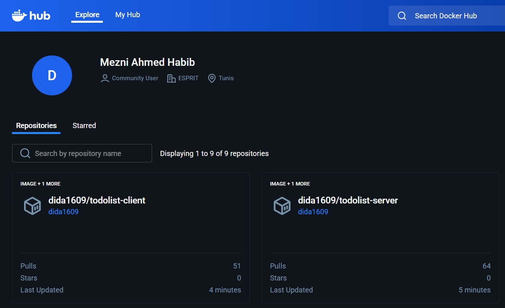
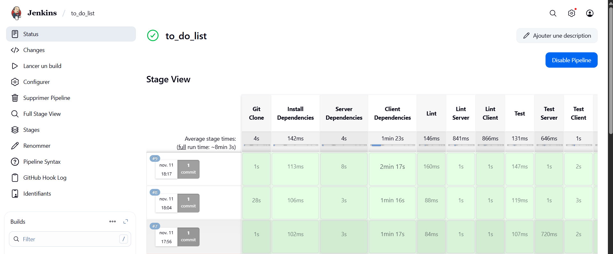
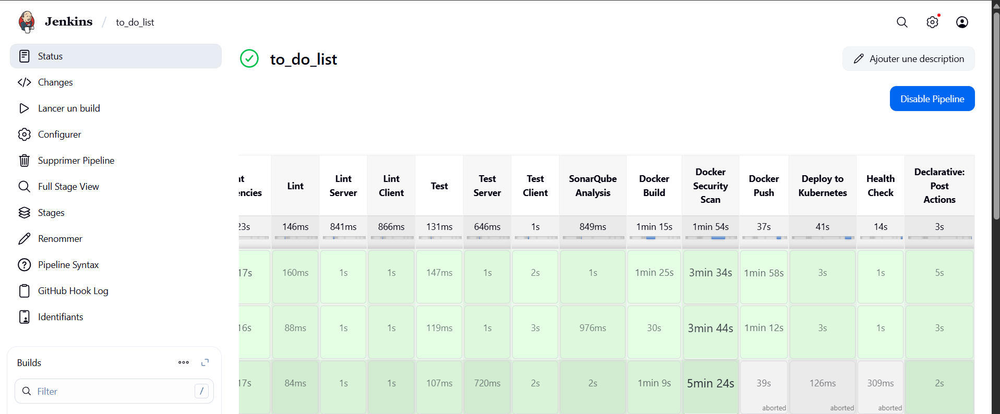
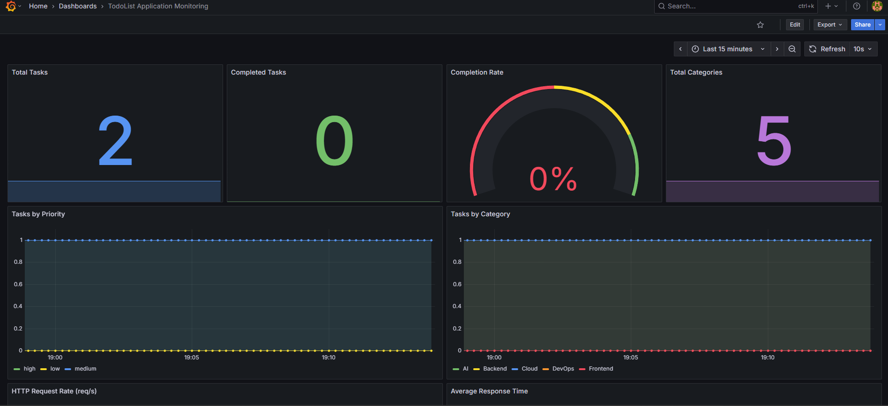
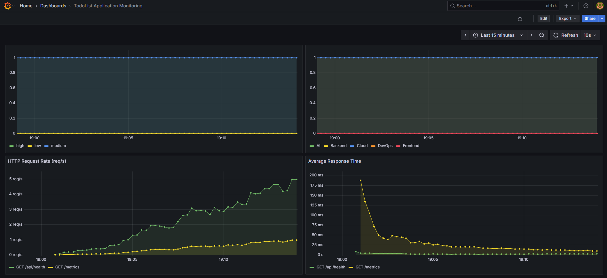

# Modern ToDoList App - DevOps Project

A containerized task management application with full CI/CD pipeline, Kubernetes orchestration, and monitoring.



## 🚀 Quick Start
```bash
# Clone repository
git clone https://github.com/didaa16/modern-todolist-app.git
cd modern-todolist-app

# Deploy to Kubernetes
kubectl apply -f k8s/

# Access application
kubectl port-forward svc/todolist-client-service 8080:80 -n todolist
# Visit: http://localhost:8080
```

## 🛠️ Tech Stack

- **Frontend:** React + Nginx
- **Backend:** Node.js + Express
- **Containers:** Docker (multi-stage builds)
- **Orchestration:** Kubernetes
- **CI/CD:** GitHub Actions + Jenkins
- **Monitoring:** Prometheus + Grafana
- **IaC:** Terraform (AWS)

## 📦 Architecture
```
GitHub → Jenkins/GitHub Actions → Docker Hub → Kubernetes
                                                    ↓
                                         [Client + Server Pods]
                                                    ↓
                                         Prometheus + Grafana
```






## 🎯 Key Features

- **Multi-stage Docker builds** (60% smaller images)
- **Kubernetes deployment** (2 replicas, load balanced)
- **Persistent storage** (PVC for data)
- **Health checks** (liveness + readiness probes)
- **Automated CI/CD** (build, test, deploy)
- **Monitoring** (custom Prometheus metrics)
- **Security scanning** (Trivy)

## 📊 Design Decisions

### 1. Multi-Stage Builds
**Why:** Reduces image size, improves security, faster deployments

### 2. Kubernetes Over Swarm
**Why:** Better ecosystem, production-standard, more features

### 3. Dual CI/CD (GitHub Actions + Jenkins)
**Why:** Fast feedback (GitHub) + full control (Jenkins)

### 4. Persistent Volumes
**Why:** Data survives pod restarts, production-ready

### 5. Prometheus Metrics
**Why:** Custom business metrics, performance tracking, proactive monitoring

### 6. Resource Limits
**Why:** Prevents resource starvation, predictable performance

## 🔧 Local Development
```bash
# Using Docker Compose
docker-compose up -d

# Frontend: http://localhost:3000
# Backend: http://localhost:5000
```

## 📈 Monitoring
```bash
# Deploy monitoring stack
kubectl apply -f monitoring/

# Access Grafana (admin/admin)
kubectl port-forward -n monitoring svc/grafana 3000:3000
```

## 🏗️ Project Structure
```
├── client/              # React app + Nginx
├── server/              # Express API + metrics
├── k8s/                 # Kubernetes manifests
├── terraform/           # AWS infrastructure
├── monitoring/          # Prometheus + Grafana
├── Jenkinsfile          # Jenkins pipeline
└── docker-compose.yml   # Local dev
```

## 📸 Results

- ✅ Application running on Kubernetes (2 replicas)
- ✅ CI/CD pipeline: 11 stages, automated deployment
- ✅ Monitoring: 6 Grafana dashboards
- ✅ Docker images: Published to Docker Hub
- ✅ Data persistence: Working across pod restarts
- ✅ Health checks: 100% uptime

## 👤 Author

**Mezni Ahmed Habib (didaa16)**
- GitHub: [@didaa16](https://github.com/didaa16)
- Docker Hub: [dida1609](https://hub.docker.com/u/dida1609)

## 🎓 Demonstrates

Container orchestration • CI/CD automation • Infrastructure as Code • Monitoring & observability • DevOps best practices

---

**⭐ Give it a star if you found this helpful!**