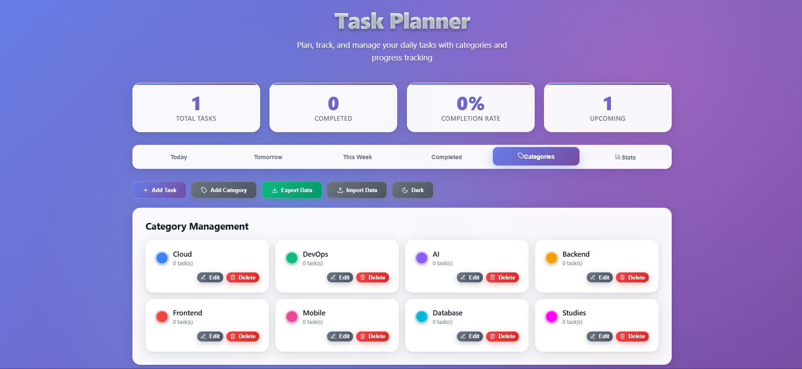

# Modern ToDoList App

A feature-rich, full-stack task management application built with React and Express.js, fully containerized with Docker and deployable to Kubernetes.



## 🏗️ Architecture

- **Frontend**: React (Nginx served)
- **Backend**: Node.js/Express
- **Containerization**: Docker (multi-stage builds)
- **Orchestration**: Kubernetes / Docker Swarm
- **CI/CD**: GitHub Actions + Jenkins
- **IaC**: Terraform (AWS)
- **Monitoring**: Prometheus + Grafana

## 📋 Prerequisites

- Docker 20.10+
- Docker Compose 2.0+
- Kubernetes 1.24+ (kubectl configured)
- Node.js 18+ (for local development)
- Terraform 1.0+ (for infrastructure provisioning)

## 🚀 Quick Start

### Local Development with Docker Compose
```bash
# Clone the repository
git clone https://github.com/didaa16/modern-todolist-app.git
cd modern-todolist-app

# Start services
docker-compose up -d

# Access the application
# Frontend: http://localhost:3000
# Backend API: http://localhost:5000
```

### Deploy to Kubernetes
```bash
# Create namespace and deploy
kubectl apply -f k8s/namespace.yaml
kubectl apply -f k8s/pvc.yaml
kubectl apply -f k8s/server-deployment.yaml
kubectl apply -f k8s/client-deployment.yaml

# Check deployment status
kubectl get pods -n todolist
kubectl get svc -n todolist
```

### Deploy with Docker Swarm
```bash
# Initialize swarm (if not already)
docker swarm init

# Deploy stack
docker stack deploy -c docker-swarm-stack.yml todolist

# Check services
docker stack services todolist
```

## 🔧 Configuration

### Environment Variables

**Server:**
- `NODE_ENV`: production/development
- `PORT`: Server port (default: 5000)

**Client:**
- Built with environment-specific configs

## 📦 Docker Images

Images are available on Docker Hub:
- Server: `dida1609/todolist-server:latest`
- Client: `dida1609/todolist-client:latest`

### Build Images Manually
```bash
# Server
docker build -t dida1609/todolist-server:latest ./server

# Client
docker build -t dida1609/todolist-client:latest ./client
```

## 🔄 CI/CD Pipeline

### GitHub Actions

Automatically triggered on push to main/master:
1. Lint & Test
2. Docker Build
3. Push to Docker Hub

Required secrets:
- `DOCKER_HUB_TOKEN`: Docker Hub access token

### Jenkins Pipeline

Complete automation including:
1. Git Clone
2. Dependencies Installation
3. Linting
4. Testing
5. SonarQube Analysis
6. Docker Build & Security Scan
7. Docker Push
8. Kubernetes Deployment
9. Health Checks

Required credentials in Jenkins:
- `Docker_Token`: Docker Hub credentials
- `Github_Token`: GitHub access token
- `SonarQube_token`: SonarQube authentication

## 🏗️ Infrastructure as Code (Terraform)

### AWS Infrastructure Setup
```bash
cd terraform

# Initialize Terraform
terraform init

# Plan infrastructure changes
terraform plan

# Apply infrastructure
terraform apply

# Destroy infrastructure (when needed)
terraform destroy
```

### Resources Created

- VPC with public subnets
- Internet Gateway
- Security Groups
- ECR Repositories (for Docker images)
- CloudWatch Log Groups
- Route Tables

## 📊 Monitoring

### Prometheus Setup
```bash
# Deploy Prometheus
kubectl apply -f monitoring/prometheus-deployment.yaml

# Access Prometheus UI
kubectl port-forward -n monitoring svc/prometheus 9090:9090
```

### Grafana Setup
```bash
# Deploy Grafana
kubectl apply -f monitoring/grafana-deployment.yaml

# Access Grafana UI
kubectl port-forward -n monitoring svc/grafana 3000:3000
```

Default credentials: admin/admin

### Key Metrics Monitored

- Request rate and latency
- Error rates (4xx, 5xx)
- CPU and Memory usage
- Pod health and availability
- Container restart counts

## 🔐 Security

- Multi-stage Docker builds (minimal attack surface)
- Security scanning with Trivy
- Non-root containers
- Resource limits in Kubernetes
- Network policies
- Secret management via Kubernetes secrets

## 🏛️ Design Decisions

### 1. Multi-Stage Docker Builds
**Why**: Reduces final image size by 60-70%, includes only runtime dependencies, improves security.

### 2. Kubernetes Over Docker Swarm
**Why**: Better ecosystem, more features (StatefulSets, DaemonSets), stronger community support, better for production at scale.

### 3. Persistent Volume Claims
**Why**: Ensures data persistence across pod restarts and rescheduling.

### 4. Separate CI/CD Pipelines
**Why**: GitHub Actions for fast feedback on PRs, Jenkins for complete deployment pipeline with more control.

### 5. Health Checks & Probes
**Why**: Liveness probes detect stuck containers, readiness probes ensure traffic only goes to ready pods.

### 6. Resource Limits
**Why**: Prevents resource starvation, enables better scheduling, predictable performance.

## 📁 Project Structure
.
├── client/                  # React frontend
│   ├── Dockerfile          # Multi-stage build
│   ├── nginx.conf          # Nginx configuration
│   ├── public/
│   └── src/
├── server/                  # Express backend
│   ├── Dockerfile          # Multi-stage build
│   ├── data/               # Persistent data
│   └── index.js
├── k8s/                     # Kubernetes manifests
│   ├── namespace.yaml
│   ├── pvc.yaml
│   ├── server-deployment.yaml
│   ├── client-deployment.yaml
│   └── ingress.yaml
├── terraform/               # Infrastructure as Code
│   ├── main.tf
│   ├── variables.tf
│   └── outputs.tf
├── monitoring/              # Monitoring configuration
│   ├── prometheus-config.yml
│   └── grafana-dashboard.json
├── .github/
│   └── workflows/
│       └── ci-cd.yml       # GitHub Actions pipeline
├── docker-compose.yml       # Local development
├── docker-swarm-stack.yml  # Docker Swarm deployment
├── Jenkinsfile             # Jenkins pipeline
└── README.md

## 🧪 Testing

### Run Tests Locally
```bash
# Server tests
cd server
npm test

# Client tests
cd client
npm test
```

### Integration Tests
```bash
# Start services
docker-compose up -d

# Run integration tests
npm run test:integration
```

## 🐛 Troubleshooting

### Pods not starting
```bash
# Check pod status
kubectl describe pod <pod-name> -n todolist

# Check logs
kubectl logs <pod-name> -n todolist

# Check events
kubectl get events -n todolist --sort-by='.lastTimestamp'
```

### Data not persisting
```bash
# Check PVC status
kubectl get pvc -n todolist

# Describe PVC
kubectl describe pvc server-data-pvc -n todolist
```

### Service not accessible
```bash
# Check service endpoints
kubectl get endpoints -n todolist

# Test service connectivity
kubectl run test-pod --rm -it --image=busybox -n todolist -- wget -O- http://todolist-server-service:5000
```

## 📚 Useful Commands

### Docker
```bash
# View running containers
docker ps

# View logs
docker logs <container-id>

# Execute command in container
docker exec -it <container-id> sh

# Clean up
docker system prune -a
```

### Kubernetes
```bash
# Get all resources
kubectl get all -n todolist

# Scale deployment
kubectl scale deployment todolist-server --replicas=3 -n todolist

# Rollback deployment
kubectl rollout undo deployment/todolist-server -n todolist

# Port forward for local access
kubectl port-forward svc/todolist-client-service 8080:80 -n todolist
```

### Docker Swarm
```bash
# List stacks
docker stack ls

# List services in stack
docker stack services todolist

# View service logs
docker service logs todolist_server

# Remove stack
docker stack rm todolist
```

## 🔄 Update Workflow

1. Make code changes
2. Commit and push to GitHub
3. GitHub Actions automatically builds and tests
4. Jenkins pipeline deploys to Kubernetes
5. Monitor deployment via Grafana dashboards

## 📈 Performance Optimization

- **Frontend**: Code splitting, lazy loading, asset compression
- **Backend**: Connection pooling, caching, async operations
- **Docker**: Multi-stage builds, layer caching
- **Kubernetes**: Horizontal pod autoscaling, resource optimization

## 🤝 Contributing

1. Fork the repository
2. Create feature branch (`git checkout -b feature/amazing-feature`)
3. Commit changes (`git commit -m 'Add amazing feature'`)
4. Push to branch (`git push origin feature/amazing-feature`)
5. Open Pull Request

## 📝 License

This project is licensed under the MIT License.

## 👤 Author

**didaa16**
- GitHub: [@didaa16](https://github.com/didaa16)
- Docker Hub: [dida1609](https://hub.docker.com/u/dida1609)

## 🙏 Acknowledgments

- React team for the amazing framework
- Kubernetes community for orchestration platform
- Docker for containerization technology